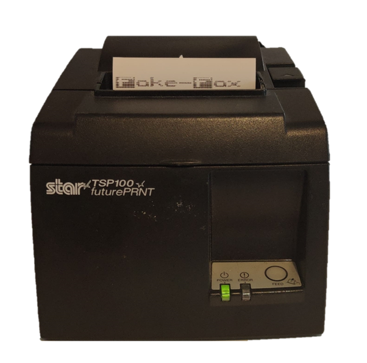

# Fake-Fax

```
MM""""""""`M          dP                         MM""""""""`M                   
MM  mmmmmmmM          88                         MM  mmmmmmmM                   
M'      MMMM .d8888b. 88  .dP  .d8888b.          M'      MMMM .d8888b. dP.  .dP 
MM  MMMMMMMM 88'  `88 88888"   88ooood8 88888888 MM  MMMMMMMM 88'  `88  `8bd8'  
MM  MMMMMMMM 88.  .88 88  `8b. 88.  ...          MM  MMMMMMMM 88.  .88  .d88b.  
MM  MMMMMMMM `88888P8 dP   `YP `88888P'          MM  MMMMMMMM `88888P8 dP'  `dP 
MMMMMMMMMMMM                                     MMMMMMMMMMMM           
```


A silly idea to print incoming emails on a receipt printer to mimic a fax because why not.
Using the gmail api we can check unread emails from specific senders and then print those.
# Setup

1. enable gmail api
2. create google creds json named `token.json`
3. pip install requirements
4. install cups
```
sudo apt install cups
```
5. [Install Drivers](https://cosroe.com/2024/05/star-tsp-100.html)
6. set gmail sender whitelist (who's emails to print)
```
echo '{"senders": ["some@email.com"]}' > sender_whitelist.json
```

# Running

Manually:
```
sh fax.sh
```
or setup a cron
